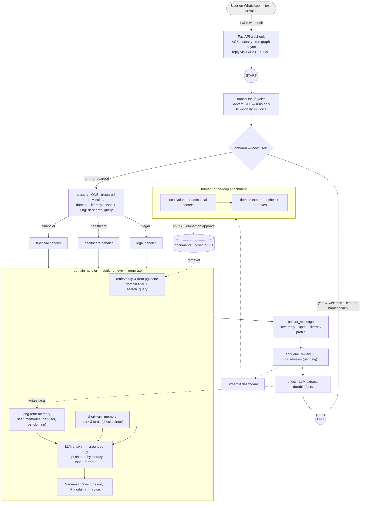

# Pucho — an AI helpline for India's urban poor

**Pucho** ("ask" in Hindi) is a WhatsApp helpline that gives low-income urban
families personalised, grounded guidance on their **legal rights, health, and
money/government-scheme** questions — by **voice or text**, in **Hindi, Marathi,
Hinglish, or English**. It is built to adapt not just to a user's language but
to their **literacy level, emotional state, context, and history** — so an
illiterate street vendor sending a worried voice note and a college student
typing a calm question get materially different answers to the same query.

> 🎥 **Demo video:** _<add Google Drive link (Anyone-with-link)>_

---

## 1. The problem

India's urban poor — daily-wage workers, domestic workers, street vendors,
migrants — routinely fall through the cracks of legal, health, and welfare
systems they are entitled to use. The barriers are rarely a lack of schemes;
they are **access barriers**:

- **Low literacy.** Forms, eligibility rules, and rights are written for readers.
  A large share of this population cannot comfortably read or write, so they
  can't self-serve on any text-first government portal or helpline.
- **Language.** Services default to English or the state language; a migrant who
  speaks only Odia or Hindi in a Marathi-majority city is locked out.
- **Fragmented, jargon-heavy information.** Even when help exists (a scholarship,
  a disability certificate, a labour-law protection), knowing *which* office,
  *which* document, and *who* to ask is its own full-time job.
- **Cost and distrust.** Repeated doctor/lawyer visits compound; people give up.

Pucho targets the access layer: meet users where they already are (WhatsApp),
in the medium they can use (**voice**), in their **own language**, with answers
pitched at their **literacy level** and pointed at a **concrete next step**.

**Grounding.** Pucho only answers from a curated knowledge base built from public
Indian sources — e.g. disability rights (RPwD Act), the UDID / disability
certificate process, the Niramaya health-insurance scheme, RTE / school-admission
rules, minimum-wage protections, and education scholarships. It never invents
statutes, schemes, dosages, or eligibility. _(See `rag_corpus/`; teams should
attach exact source citations here.)_

### Personas (5)

| Persona | Domain(s) | Literacy · channel · language | Need |
|---|---|---|---|
| **Jyotsana**, 42, homemaker | legal | illiterate · voice · Hindi | **Wage rights** — minimum wage, unpaid/underpaid daily-wage work, overtime, where to complain |
| **Manisha**, 38, domestic worker (MA) | healthcare + legal | literate · text · Marathi | Newly-diagnosed **autistic son (7)**: care guidance, therapy/NGO schemes, UDID certificate, fighting school-admission denials |
| **Gaurav**, 21, commerce student | financial | literate · text · Hinglish | **Scholarships** for college — eligibility, low-income options, how to apply + documents |
| **Mohan**, 50, street vendor (migrant) | legal | illiterate · voice · Hinglish | **Driving licence** — process, documents, applying as a low-literacy migrant, RTO, learner vs permanent |
| **Hema**, social worker | legal (expert) | — · dashboard | Reviews and enriches answers as the human-in-the-loop domain expert |

Two of the five (Jyotsana, Mohan) have little-to-no reading/writing ability and
interact by voice. Hema is not a WhatsApp user — she is the **domain expert** on
the review dashboard, closing the human-in-the-loop knowledge loop.

---

## 2. How it works (architecture)

Pucho is built as a **LangGraph workflow, not a multi-agent system** — a
deliberate choice. The task is grounded Q&A in regulated domains, which rewards
**predictability over autonomy**, so we use a deterministic graph with LLM calls
at specific nodes rather than agents that dynamically direct themselves. Even the
STT/TTS "tools" are **called deterministically** — the graph runs them on an `if`
gated on the message's modality, they are never *selected* by an LLM — so no node
in the graph is an autonomous agent.



**What each node does:**

- **`transcribe_if_voice`** — Sarvam STT (`saarika:v2`, auto-detect) transcribes a
  voice note *in its original language* (no translation). It runs only when
  `modality == "voice"` — the graph decides this with a plain `if`; the LLM never
  chooses to call it. STT is wrapped as a LangChain tool for reuse, but here it is
  a deterministic function call, not an agent action.
- **`onboard`** — on first contact, sends one warm, plain-language welcome
  (spoken aloud via TTS for voice users), captures the user's name, and invites
  their question. Literacy-friendly by design.
- **`classify`** — the one decision point. A single structured LLM call returns
  **four** things at once (so personalisation costs no extra round-trip): the
  **domain**, an inferred **literacy level**, the message's **emotional tone**,
  and an English **search_query** for retrieval (see §4).
- **domain node** (legal / healthcare / financial) — retrieves the top-4
  domain-scoped chunks from pgvector, injects the user's stored facts, builds a
  personalised prompt, and generates a grounded answer. For voice, it synthesises
  a reply with Sarvam TTS (`bulbul:v2`) — again a deterministic call gated on
  modality, not a tool the model elects to use.
- **`persist_message` → `enqueue_review` → `reflect`** — logs the exchange, queues
  it for expert review (Stream 2 below), and extracts durable facts into
  long-term memory.

**Honest framing.** No node here is an autonomous agent. An *agent* is an LLM that
decides, in a loop, which tools to call — Pucho has no such loop. The STT/TTS
"tools" are invoked by the graph on a modality `if` (not model-selected), routing
is a single structured-output classification (not a tool loop), and the domain
handlers use no tools at all (`create_agent(tools=[])`) — they retrieve once and
generate. So this is **classifier-routed static RAG**, not agentic RAG: the
control flow is ours, not the model's. Short-term conversational memory is handled
by LangGraph's `AsyncPostgresSaver` checkpointer (append-only history per user
thread); long-term per-user memory lives in a `user_memories` table.

---

## 3. Personalisation beyond language

The brief asks for adaptation beyond language switching. Pucho's `classify` call
profiles each message, and a single templated system prompt
(`services/agents/style.py`) is assembled per turn from four signals:

| Signal | Source | Effect on the reply |
|---|---|---|
| **domain** | classifier | which specialist + its safety rules |
| **literacy** (low/med/high) | classifier + a **persisted running profile** on the user (voice ⇒ low prior) | vocabulary, sentence length, jargon vs plain words, lists vs prose, "one clear next action" |
| **tone** (worried/distressed/frustrated/hopeful) | classifier (per message) | empathy / reassurance framing |
| **modality** (voice/text) | channel | voice replies are TTS-safe (no markdown/bullets), kept short |

A low-literacy, distressed voice caller gets short, calm, jargon-free, spoken
guidance ending in one concrete step; a literate, calm texter gets a precise,
structured answer. The literacy profile is **persisted and refined over the
week**, so personalisation deepens as the bot learns the user.

---

## 4. Language handling

Pucho preserves the user's language end-to-end **without a translate-to-English-
and-back round trip**. Voice is transcribed in its original language (Sarvam
STT, no translation); text passes through as-is. Because the LLM is natively
multilingual, it reads the question in Hindi/Marathi/Hinglish/English directly
and a prompt instruction keeps the **reply in that same language**; voice replies
are spoken back in the detected language via Sarvam TTS.

The one weak point was **retrieval**: our corpus is English, so embedding a Hindi
query against English chunks gave weaker matches for exactly the non-English users
we built for. We fixed this with a **query-translation step folded into the
existing `classify` call** — it emits an English, keyword-rich `search_query` used
*only* for document retrieval, while the reply is still generated from the user's
original question in their own language. Zero extra latency, no migration.

**At scale**, the proper fix is to remove the mismatch at the embedding layer:
a **multilingual embedding model** (e.g. `text-embedding-3-large`, Cohere
`embed-multilingual-v3`, or BGE-M3) that maps all languages into one vector space,
a corpus **stored in each target language**, an **output-language verifier**
(rather than trusting a prompt instruction), and **language-aware hybrid search**
(dense + full-text/BM25) to handle transliterated / code-mixed "Hinglish" queries.

---

## 5. The knowledge base — two streams + human-in-the-loop

Both streams write to one `documents` table (pgvector) and are retrieved
uniformly. Retrieval is domain-scoped cosine-distance ANN over an HNSW index.

- **Stream 1 — static corpus (seeded).** `scripts/seed_documents.py` chunks +
  embeds the curated `rag_corpus/<domain>/*.md` files (`source='manual'`).
- **Stream 2 — expert-approved Q&A (continuous).** Every real answer is queued
  for review. On a **Streamlit dashboard**: a **local volunteer** adds local
  context, then a **domain expert** enriches and approves. Approval ingests the
  enriched answer back into the knowledge base (`source='expert_approved'`), so
  the system **gets smarter from real usage**. Crucially, ingestion happens
  **only if the expert actually added new content** — accepting the bot's answer
  as-is writes nothing, to avoid polluting the KB with paraphrased duplicates.

This is where Hema (expert) and Gaurav (volunteer) come in, and it's the product's
core loop: community + expert knowledge compounding over time.

---

## 6. Tech stack

| Layer | Choice |
|---|---|
| Orchestration | **LangGraph** `StateGraph` (+ `AsyncPostgresSaver` for short-term memory) |
| LLM | **OpenAI** `gpt-4o-mini` (routing, answering, reflection, onboarding) |
| Embeddings | OpenAI `text-embedding-3-small` (1536-d) |
| Speech | **Sarvam AI** — `saarika:v2.5` (STT) / `bulbul:v2` (TTS) |
| Messaging | **Twilio** WhatsApp (webhook) |
| API | **FastAPI** + Uvicorn |
| Database | **Supabase** Postgres + **pgvector** (HNSW) |
| Models / migrations | **SQLModel** + **Alembic** (native enums for domain/role/…) |
| Dashboard | **Streamlit** (volunteer + expert review pages) |
| Voice hosting | Vercel Blob (public URL for TTS audio in TwiML) |
| Tooling | **uv** (deps), **Docker** / docker-compose, cloudflared (dev tunnel) |

**Data model (8 tables):** `whatsapp_users`, `dashboard_users`, `messages`,
`user_memories`, `local_volunteers`, `domain_experts`, `qa_reviews`, `documents`.

---

## 7. Running it

**Prerequisites:** Python 3.13, `uv`, a Postgres DB with `pgvector` (Supabase),
and API keys for OpenAI, Sarvam, and Twilio in `.env` (see `.env.example`).

```bash
uv sync                                   # install deps
uv run alembic upgrade head               # create the schema
uv run python scripts/seed_documents.py   # Stream 1: ingest the corpus
uv run python scripts/seed_reviewers.py   # create demo volunteer + experts

# WhatsApp webhook (Twilio → this app)
uv run main.py                            # FastAPI on :8000
cloudflared tunnel --url http://localhost:8000   # public URL for Twilio

# Review dashboard
PYTHONPATH=. uv run streamlit run services/dashboard/app.py   # :8501

# Or everything in containers:
docker compose up --build
```

**1-week simulation (per persona):**

```bash
uv run python scripts/simulate.py --reset --enrich
```

Drives each persona's 7-day message script through the real router graph and
prints, per turn, the reply plus the personalisation signals
(`domain / literacy / tone`), then what the bot remembered — and runs the
volunteer→expert enrichment loop. See `scripts/personas.py` for the scripts.

---

## 8. Limitations & what "at scale" looks like

We chose to ship a reliable, honest slice rather than overclaim. Known
limitations and the intended path forward:

- **Single-domain routing.** `classify` picks exactly one domain, so genuinely
  cross-domain questions (most of our personas!) only see one corpus.
  **At scale:** an orchestrator that fans out to multiple domain handlers in
  parallel and a synthesis step that merges them — this is the step that turns it
  into a genuine **multi-agent** system.
- **Not agentic.** Handlers retrieve once, unconditionally (`tools=[]`).
  **At scale:** tool-using agents that decide *whether* to retrieve, rewrite
  queries, retrieve iteratively, and a **verifier agent** that checks the answer
  is grounded before sending (critical for regulated advice).
- **Cross-lingual retrieval** is patched via query translation.
  **At scale:** multilingual embeddings + multilingual corpus + hybrid search
  (see §4).
- **Reply language is a soft guarantee** (a prompt instruction).
  **At scale:** an explicit output-language check.
- **Safety & trust.** Twilio signature validation is enabled only in production;
  no PII redaction, rate limiting, or abuse handling yet.
  **At scale:** signed webhooks everywhere, PII handling, guardrails, per-user
  rate limits, and audit-grade logging.
- **Retrieval at volume.** A single global HNSW index post-filters by domain.
  **At scale:** per-domain partial HNSW indexes (or pgvector iterative scan) for
  filtered recall.
- **Ops.** Add observability/tracing, retries/backoff on provider errors, and a
  proper (non-tunnel) deployment.

---

## 9. Repository layout

```
api/
  main.py             FastAPI app (webhook + /healthz); ACK fast, reply via Twilio REST
  routes/whatsapp/    Twilio adapter (form ↔ router state) + audio (TTS → Vercel Blob)
config/               settings (.env) + async DB engine (db.py) + LangGraph checkpointer
models/               SQLModel tables + shared enums (8 tables)
crud/                 async DB operations (one module per table)
services/
  agent/              router graph (router.py) + onboarding + retriever (interface) + style (prompt template)
  RAG/                domain handlers — legal / healthcare / financial (retrieve → generate, tools=[])
  knowledge/          corpus ingest + expert-approval ingest (enqueue) + pgvector retriever impl
  memory/             reflect (fact extraction) + inject (facts → prompt) + vocab
  tools/              Sarvam STT / TTS
  dashboard/          Streamlit review app (auth + Local Volunteer + Expert views)
alembic/              migrations
rag_corpus/           the curated knowledge corpus (legal / healthcare / financial)
scripts/              seed_documents, seed_reviewers, simulate (+ personas config)
main.py               local dev entrypoint (uvicorn); Dockerfile / docker-compose.yml; vercel.json
```
